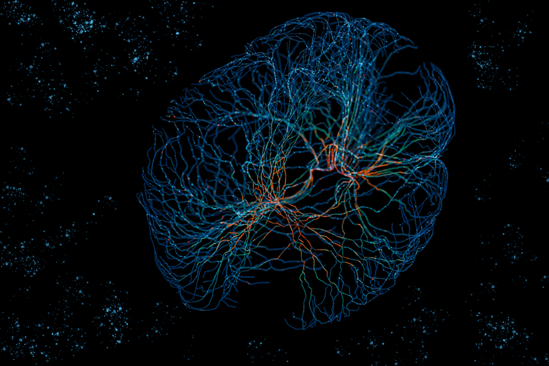

## Docker Model Runner & LLMs for AI Keyword Extraction: A Reproducible Benchmark 
#### A guide to containerizing and comparing a 7B parameter Mistral model against classic NLP methods using Docker Compose. 

**Author:** Mohammed Aminoor Rahman 
**Date:** September 25th, 2025

### TL;DR
- This project solves the challenge of comparing traditional NLP methods against modern LLMs by creating a fully containerized, one-command experiment using Docker Compose.
- Quantitative analysis of the results shows the LLM's output is consistently more semantically aligned with the source text, achieving a higher cosine similarity score than the combined baseline methods.
- The LLM (Mistral 7B) produces a hierarchically structured, conceptual analysis, while the baseline methods (RAKE, TF-IDF, KeyBERT, and Noun Chunking) excel at identifying statistically significant, literal terms.

---

### **Table of Contents**
1.  [Problem & Context](#problem--context)
2.  [Solution Overview & Architecture](#solution-overview--architecture)
3.  [Environment & Prerequisites](#environment--prerequisites)
4.  [Step-by-Step Implementation](#step-by-step-implementation)
5.  [Evaluation Metrics](#evaluation-metrics)
6.  [Results](#results)
7.  [Discussion](#discussion)
8.  [Limitations & Next Steps](#limitations--next-steps)
9.  [How to Reproduce](#how-to-reproduce)
10. [References](#references)

---



### **Problem & Context**

Developers and data scientists face a critical choice: for foundational tasks like keyword extraction, should they use established, lightning-fast Natural Language Processing (NLP) algorithms or pivot to the more powerful, but complex, Large Language Models (LLMs)? While traditional methods like TF-IDF (Term Frequency-Inverse Document Frequency) are predictable and efficient, LLMs promise a deeper, more human-like understanding of text.

Furthermore, AI experiments are notoriously difficult to reproduce. Differences in operating systems, package versions, and model availability can lead to inconsistent results. This project tackles both problems head-on by building a fully containerized experiment to fairly compare these two approaches.

---

### **Solution Overview & Architecture**

To create a fair and reproducible testing ground, a multi-service application was designed and orchestrated by Docker Compose. The system runs classic NLP methods and a generative LLM in parallel, processes a dataset of text files, and generates a final quantitative comparison.

The architecture is composed of independent but connected containerized services managed by the Docker Engine. A key feature is the use of a health check to ensure the LLM model server is fully initialized before dependent services begin processing, creating a robust, automated workflow. The system also exposes a persistent API for real-time, interactive analysis.


***Figure 1 System Architecture:**: The layered architecture showing the Host Machine, the Docker Engine, and the containerized services it manages, along with volume mounts that link the host filesystem to the containers.*

#### Keyword Extraction Parameters

To ensure a fair comparison, the following parameters were used across the extraction methods:
- **Top-K**: The top 15 keywords or phrases were requested from each method (TOP_N_KEYWORDS=15).
- **Deduplication**: Uniqueness is enforced within each method. For Noun Chunking, a set is used to store phrases, inherently removing duplicates. For rank-based methods like RAKE and KeyBERT, deduplication is a natural result of the ranking process.
- **Tie Handling**: In cases of tied scores, tie-breaking is handled by the default, deterministic behavior of the underlying libraries (e.g., Scikit-learn, KeyBERT), which typically relies on the order of appearance.

#### API Endpoint Details

The api service provides a real-time endpoint for on-demand analysis.

- **Endpoint**: POST /extract
- **Rate Limits**: The service does not currently implement authentication or rate-limiting.
- **Request Schema**: The endpoint expects a JSON body with a single key.

```json
{
    "text": "Your text to be analyzed goes here..."
}
```

- **Response Schema**: The endpoint returns a JSON object containing a full comparative analysis.

```json
{
    "llm_analysis": {
        "primary_keywords": [...],
        "secondary_keywords": [...],
        "key_phrases": [...],
        "long_tail_phrases": [...],
        "evidence_sentences": [...],
        "confidence": 0.0,
        "must_include": []
    },
    "baseline_analysis": {
        "rake": [...],
        "tfidf": [...],
        "keybert": [...],
        "noun_chunks": [...]
    }
}
```

- **Example curl Request**:

```
curl -X POST http://localhost:5001/extract \
-H "Content-Type: application/json" \
-d '{"text": "A cryptocurrency is a digital currency designed to work through a computer network."}'
```

---

### **Environment & Prerequisites**

This experiment is designed to be fully reproducible. The only requirement to run it is a working installation of Docker Desktop. All Python libraries, models, and dependencies are managed within the containerized environment.

#### System Configuration

- **Tested on**: Windows 11 with WSL 2, Docker Desktop 4.46
- **Container OS**: python:3.11-slim
- **Key Libraries**: scikit-learn=1.5.0, keybert=0.8.0, spacy=3.7.5, ollama=0.2.1
- **Generative Model**: mistral:latest (Mistral 7B Instruct) served via the ollama/ollama Docker image.

#### Dataset Details

The dataset consists of 30 plain text files generated using the Wikipedia API.
- **Domain**: The content is sourced from a seed list of topics primarily focused on science, technology, and economics (e.g., "Artificial intelligence," "Blockchain," "Quantum computing").
- **Language**: English (en).
- **Document Length**: Each document is truncated to a maximum of 300 words.
- **Tokenization**: Standard whitespace tokenization is used.

#### Preprocessing Steps

Before analysis, both the baseline and LLM scripts apply the same minimal preprocessing to the source text:
- **Lowercasing**: All text is converted to lowercase.
- **Whitespace Normalization**: All newline characters (\n) are replaced with a single space to create a continuous block of text.

#### LLM Parameters

The LLM is prompted to generate a structured JSON output. The following parameters and schema are used for the API calls
- **Decoding Parameters**:
    - **temperature**: Two experiments are run. A "medium-low" setting of 0.3 for factual extraction and a "high" setting of 0.9 to observe creative output.
    - **top_p**: Set to 1.0 for the low-temperature test and 0.9 for the high-temperature test.
    - **format**: Set to json to enforce structured output from the Ollama server.
- **Prompt Template**: The prompt instructs the model to act as a precise text analysis engine and adhere to strict rules, including extracting terms directly from the source text.
- **JSON Schema**: The model is required to return its analysis in the following JSON format:

```json
{
  "primary_keywords": ["..."],
  "secondary_keywords": ["..."],
  "key_phrases": ["..."],
  "long_tail_phrases": ["..."],
  "evidence_sentences": ["..."],
  "confidence": 0.0,
  "must_include": []
}
```

---

### **Step-by-Step Implementation**
The core of this project is the docker-compose.yml file, which defines the entire application stack.


***Figure 2 Workflow Diagram:**: A flowchart illustrating the sequence of events triggered by docker compose up, from the Ollama health check to the parallel execution of the processors and the final comparison step.*

The key to making this work is the healthcheck in the ollama service. This ensures that the other services that depend on the LLM will not even start until the multi-gigabyte Mistral model is fully downloaded and ready to serve requests, which solves a critical race condition.

```yaml
# docker-compose.yml snippet
services:
  ollama:
    build:
      context: .
      dockerfile: docker/ollama.Dockerfile
    volumes:
      - ollama_data:/root/.ollama
    healthcheck:
      test: ["CMD-SHELL", "ollama list | grep mistral:latest"]
      # ...

  text-processor:
    build:
      context: .
      dockerfile: docker/Dockerfile
    depends_on:
      ollama:
        condition: service_healthy # This container waits for the health check to pass
    # ...
```

The entire experiment is launched with a single command:
```docker compose up --build```

---

### **Evaluation Metrics**

To quantitatively compare the two methods, we defined three metrics calculated by our comparison.py script.

#### Jaccard Similarity

This metric measures the overlap of unique words between the baseline and LLM keyword sets. It is calculated by dividing the size of the intersection of the two sets by the size of their union. A higher score indicates more shared vocabulary.

$$
J(A,B) = \frac{|A \cap B|}{|A \cup B|}
$$

#### Average Phrase Length

This metric measures the complexity and descriptiveness of the keywords by calculating the average number of words per keyword/phrase for each method. A higher average suggests more conceptual and detailed output.

#### Semantic Similarity

This metric serves as a proxy for contextual relevance, simulating how a modern search engine might rank the keywords. To compute this, all keywords for a given method are first concatenated into a single string to create a "pseudo-summary." The sentence-transformers library (all-MiniLM-L6-v2 model) then encodes this summary and the original source text into high-dimensional vectors. This encoding process uses a mean pooling strategy to create a single embedding from the individual word tokens and applies L2 normalization. Finally, the cosine similarity between the two resulting vectors is calculated, yielding a score where a higher value indicates a stronger semantic relationship.

---

### **Results**

The script outputs the results to a CSV file located at artifacts/semantic_comparison_results.csv.


***Figure 3 Quantitative Comparison Results:**: A table showing the calculated metrics for a sample of documents, generated from artifacts/semantic_comparison_results.csv.*

Visually, the difference in output is immediately apparent. The baseline methods produce flat lists of statistically relevant terms. The LLM produces a structured, hierarchical analysis.


***Figure 4 Qualitative Output Comparison**: A side-by-side screenshot comparing the raw JSON output from the baseline script and the medium-temperature LLM script for the same document.*

---

### **Discussion**
The results from the quantitative analysis (Figure 3) are revealing. The Jaccard Similarity is consistently low (0.2-0.4), which confirms that the LLM is not merely identifying the same statistically frequent words as the baseline methods; it's finding different information.

The Average Phrase Length is significantly higher for the LLM, providing numerical evidence that it generates more complex and conceptual phrases. Most importantly, the Semantic Similarity score is consistently higher for the LLM's output. This indicates that the LLM's keywords are more contextually and semantically aligned with the overall meaning of the source text, a strong proxy for what a search engine would consider relevant.

The trade-off is performance. The multithreaded baseline script processed 30 files in under a minute, whereas the LLM script took several minutes.

---

### **Limitations & Next Steps**

This experiment provides a solid foundation but has limitations. We only used one generative model (Mistral 7B) and focused on a single task (keyword extraction).

Next Steps could include:
- **Benchmarking other models**: Swapping mistral:latest for other models like llama3 or gemma to compare their analytical quality.
- **Expanding the task**: Modifying the prompts to perform other tasks, such as summarization or sentiment analysis.
- **Cloud Deployment**: Adapting the API service for deployment to a cloud environment using Kubernetes.

--- 

### **How to Reproduce**

This experiment is fully containerized and managed by Docker Compose. The following steps detail the project structure and the commands needed to replicate the entire analysis.

#### Project Structure

The repository is organized with a clear separation between application code, container configurations, and data.


***Figure 5 Project File Structure**: The organized layout of the repository, showing the clear separation between application code (e.g., api), container configurations (docker/), and data folders (dataset/, output/).*

#### Prerequisite

To replicate this experiment, you only need one piece of software installed:
- Docker Desktop

#### Setup & Execution

All Python dependencies listed in the “ requirements/ ” files are automatically installed inside their respective containers when you build the images. There is no local pip install required.

**To Run the Full Batch Experiment (and generate the final CSV):**
This is the primary command. It builds all images, starts the services in the correct order, runs the batch processors (baseline-processor and text-processor), waits for them to finish, runs the final comparison script, and then exits.

```docker compose up --build```

After the command finishes, you can run docker compose down to clean up any services that may remain (like the API).

**To Run Only the Interactive API:**
If you only want to start the API and its Ollama dependency for real-time testing with a tool like Thunder Client, use this command:

```docker compose up --build api```

To stop the API and Ollama services when you are finished, press Ctrl + C and then run docker compose down.

#### Output Artifacts

After running the full experiment, the following outputs (artifacts) will be created in your project directory:
- **baseline_outputs/baseline_keywords.json**: A single JSON file containing the keywords generated by the classic NLP methods for every document.
- **output/**: This directory will be populated with two JSON files per input document, generated by the Mistral LLM with different creativity settings.
- **./semantic_comparison_results.csv**: The final quantitative analysis, comparing the baseline and LLM outputs on key metrics.

---

### **References**

- Ollama Documentation. (n.d.). Retrieved September 25, 2025, from [https://docs.ollama.com/](https://docs.ollama.com/)
- Docker Documentation. (n.d.). Retrieved September 25, 2025, from [https://docs.docker.com/](https://docs.docker.com/)
- Mistral AI Documentation. (n.d.). Retrieved September 25, 2025, from [https://docs.mistral.ai/](https://docs.mistral.ai/)
- NLTK Project. (n.d.). Natural Language Toolkit Documentation. Retrieved September 25, 2025, from [https://www.nltk.org/](https://www.nltk.org/)
