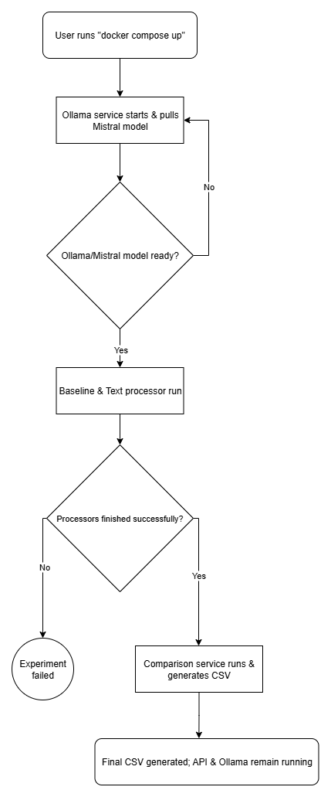

# A Comparative Analysis of LLM vs. Traditional NLP for Keyword Extraction

This project provides a fully containerized environment to conduct a comprehensive analysis of keyword extraction techniques. It pits a modern generative Large Language Model (**Mistral 7B**) against four classic Natural Language Processing (NLP) methods (**RAKE**, **TF-IDF**, **KeyBERT**, and **Noun Chunking**).

The entire experiment—from data generation to final comparison—is orchestrated by **Docker Compose**. This creates a reproducible, self-contained system that automatically builds all necessary environments, runs the batch processing scripts, and launches an interactive API.

---

## System Architecture

The application is composed of five independent but connected services managed by Docker Compose, as detailed in the System Architecture diagram (Figure 1). The repository is organized with a clear separation between application code and container configurations for maintainability (Figure 2). A key feature is the use of a health check to ensure the Ollama model server is fully initialized before the processing services begin their work. This creates a robust, automated workflow, which is illustrated in the execution flowchart (Figure 3).


***Figure 1 System Architecture:**: The layered architecture showing the Host Machine, the Docker Engine, and the containerized services it manages, along with volume mounts that link the host filesystem to the containers.*


***Figure 2 Project File Structure**: The organized layout of the repository, showing the clear separation between application code (e.g., api), container configurations (docker/), and data folders (dataset/, output/).*



***Figure 3 Workflow Diagram:**: A flowchart illustrating the sequence of events triggered by docker compose up, from the Ollama health check to the parallel execution of the processors and the final comparison step.*

---
## Prerequisite

To replicate this entire experiment, you only need one piece of software installed:
* **Docker Desktop**

---
## How to Run the Full Experiment

With the entire workflow containerized, running the full experiment is done with a single command. This command will build all the necessary images, start the services in the correct order, run the batch jobs to completion, and then launch the API.

**1. Build and Run the Application:**
```bash
docker compose up --build
```
The first time you run this, it will take several minutes to download the multi-gigabyte Mistral model. On subsequent runs, it will start much faster.

**What this command does:**
* Starts the **Ollama** service and automatically downloads the Mistral model.
* Runs the **`baseline-processor`** service to generate the classic NLP keywords.
* Runs the **`text-processor`** service to generate the LLM keywords.
* Runs the **`comparison`** service to analyze the results and create `semantic_comparison_results.csv`.
* Starts the **`api`** service and keeps it running for real-time requests.

**2. Test the Live API:**
Once the batch jobs are complete, you can test the running API by sending a `POST` request to `http://localhost:5001/extract` using a tool like Thunder Client.

**3. Shut Down the Application:**
To stop the long-running services (Ollama and the API), press `Ctrl + C` in the terminal, then run:
```bash
docker compose down
```

---
## Expected Output

After running the experiment, your project directory will contain:

1.  **`baseline_outputs/baseline_keywords.json`**: A single file with keywords from the classic NLP methods.
2.  **`output/`**: A folder with two JSON files per document from the Mistral LLM (medium-low and high temperature).
3.  **`semantic_comparison_results.csv`**: The final quantitative analysis comparing the baseline and LLM outputs on metrics like Jaccard similarity and semantic relevance.

---
## Technology Stack

* **Containerization**: Docker, Docker Compose
* **Web Framework**: Flask
* **AI Model Serving**: Ollama
* **Generative Model**: Mistral 7B
* **Baseline NLP Libraries**: NLTK, Scikit-learn, KeyBERT, spaCy
* **Comparison Libraries**: Pandas, Sentence-Transformers